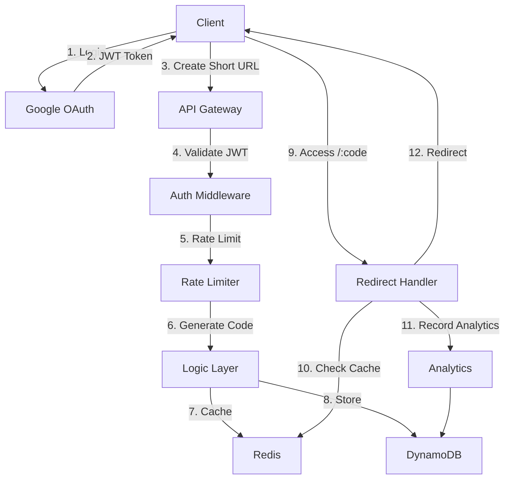

# 🔗 patrn.ink - Production-Ready URL Shortener

A feature-rich URL shortener built with Go, featuring OAuth 2.0 (Google & GitHub), real-time analytics, QR code generation, and custom short links. Perfect for showcasing modern backend development skills.

## ✨ Features

- **🔐 OAuth 2.0 Authentication** - Google and GitHub Sign-In support
- **🔑 API Tokens** - Personal access tokens with scopes for programmatic access
- **📊 Analytics Dashboard** - Track clicks, referrers, devices, browsers, countries, and more
- **🎨 Custom Short Codes** - Create memorable branded links (e.g., `/resume`, `/portfolio`)
- **📱 QR Code Generation** - Dynamic QR codes for every short URL
- **⏰ Link Expiration** - Set TTL for temporary links
- **📅 Scheduled Links** - Schedule links to go live at a specific time
- **🔒 Password Protection** - Secure links with password access
- **🔞 Age Verification** - Age gates for restricted content (13+, 18+, 21+)
- **🏷️ Tags & Organization** - Categorize links with custom tags
- **📦 Bulk Operations** - Import/export links and analytics in bulk
- **🔗 Link Previews** - Fetch URL metadata (title, description, favicon)
- **🚦 Rate Limiting** - Token bucket algorithm to prevent abuse
- **⚡ Redis Caching** - Ultra-fast redirects
- **🗄️ DynamoDB Storage** - Scalable NoSQL backend
- **📖 Swagger Documentation** - Interactive API docs
- **🐳 Docker Support** - Complete containerization

## 🏗️ Architecture



## 🚀 Quick Start

### Prerequisites

- Go 1.24+
- Docker & Docker Compose
- Google Cloud Console account (for OAuth)
- GitHub OAuth App (optional, for GitHub login)

### 1. OAuth Setup

**Google OAuth:**

1. Go to [Google Cloud Console](https://console.cloud.google.com/)
2. Create a new project or select existing
3. Enable **Google+ API**
4. Create **OAuth 2.0 Client ID** (Web application)
5. Add authorized redirect URI: `http://localhost:8080/auth/google/callback`
6. Copy **Client ID** and **Client Secret**

**GitHub OAuth (Optional):**

1. Go to [GitHub Developer Settings](https://github.com/settings/developers)
2. Create a new OAuth App
3. Set callback URL: `http://localhost:8080/auth/github/callback`
4. Copy **Client ID** and **Client Secret**

### 2. Environment Configuration

```bash
cp .env.example .env
# Edit .env with your Google OAuth credentials
```

### 3. Run with Docker

```bash
# Start all services
docker-compose up --build
```

The application will be available at `http://localhost:8080`

## 📚 API Endpoints

### Authentication

| Method | Endpoint                | Description           |
| ------ | ----------------------- | --------------------- |
| GET    | `/auth/google/login`    | Start Google OAuth    |
| GET    | `/auth/google/callback` | Google OAuth callback |
| GET    | `/auth/github/login`    | Start GitHub OAuth    |
| GET    | `/auth/github/callback` | GitHub OAuth callback |
| GET    | `/api/me`               | Get current user      |

### URL Management (Protected)

| Method | Endpoint                      | Description        |
| ------ | ----------------------------- | ------------------ |
| POST   | `/api/shorten`                | Create short URL   |
| GET    | `/api/links`                  | List user's links  |
| GET    | `/api/links/:code`            | Get link details   |
| PUT    | `/api/links/:code`            | Update link        |
| DELETE | `/api/links/:code`            | Delete link        |
| GET    | `/api/analytics/:code`        | Get link analytics |
| GET    | `/api/analytics/:code/export` | Export analytics   |

### Bulk Operations (Protected)

| Method | Endpoint            | Description         |
| ------ | ------------------- | ------------------- |
| POST   | `/api/bulk/import`  | Bulk import links   |
| POST   | `/api/bulk/delete`  | Bulk delete/archive |
| GET    | `/api/export/links` | Export all links    |

### API Tokens (Protected)

| Method | Endpoint                     | Description             |
| ------ | ---------------------------- | ----------------------- |
| POST   | `/api/tokens`                | Create API token        |
| GET    | `/api/tokens`                | List API tokens         |
| DELETE | `/api/tokens/:id`            | Revoke API token        |
| PUT    | `/api/tokens/:id/rate-limit` | Update token rate limit |

### Public

| Method | Endpoint            | Description               |
| ------ | ------------------- | ------------------------- |
| GET    | `/:code`            | Redirect to long URL      |
| POST   | `/:code/verify`     | Verify password           |
| POST   | `/:code/verify-age` | Verify age                |
| GET    | `/:code/qr`         | Get QR code image         |
| GET    | `/:code/preview`    | Get link preview metadata |
| GET    | `/api/preview`      | Fetch URL preview         |
| GET    | `/health`           | Health check              |
| GET    | `/swagger/*`        | Swagger documentation     |

### Swagger Documentation

Interactive API documentation is available at `/swagger/index.html` when the server is running.

**Regenerating Swagger Docs:**

After modifying API handler annotations, regenerate the docs:

```bash
# Install swag CLI (one-time)
go install github.com/swaggo/swag/cmd/swag@latest

# Regenerate swagger docs
swag init -g cmd/api/main.go -o docs --parseDependency
```

## 💡 Usage Examples

### Create Short URL

```bash
# Login and get JWT token first, or use API token
curl -X POST http://localhost:8080/api/shorten \
  -H "Authorization: Bearer YOUR_JWT_TOKEN" \
  -H "Content-Type: application/json" \
  -d '{
    "long_url": "https://example.com/very/long/url",
    "custom_code": "my-link",
    "title": "My Link",
    "description": "A description",
    "expires_in": 168,
    "tags": ["portfolio", "resume"],
    "password": "secret123",
    "age_verification": 0
  }'
```

Response:

```json
{
	"short_url": "http://localhost:8080/my-link",
	"short_code": "my-link",
	"long_url": "https://example.com/very/long/url",
	"qr_code_url": "http://localhost:8080/my-link/qr",
	"expires_at": "2026-01-25T18:00:00Z",
	"tags": ["portfolio", "resume"]
}
```

### Using API Tokens

```bash
# Create an API token
curl -X POST http://localhost:8080/api/tokens \
  -H "Authorization: Bearer YOUR_JWT_TOKEN" \
  -H "Content-Type: application/json" \
  -d '{
    "name": "My CLI Token",
    "scopes": ["links:read", "links:write", "analytics:read"],
    "expires_in": 30
  }'

# Use API token (X-API-Key header)
curl http://localhost:8080/api/links \
  -H "X-API-Key: pat_xxxxxxxxxxxxxxxx"
```

### Access Short URL

```bash
curl -L http://localhost:8080/my-link
# Redirects to https://example.com/very/long/url
```

### Get QR Code

```bash
curl http://localhost:8080/my-link/qr -o qrcode.png
```

## 🧪 Testing

```bash
# Run tests
go test -race ./...

# Check coverage
go test -cover ./...
```

## 📊 Monitoring

### Health Check

```bash
curl http://localhost:8080/health
```

Response:

```json
{
	"status": "healthy",
	"dynamodb": true,
	"redis": true,
	"hostname": "api-server-1",
	"version": "1.0.0",
	"timestamp": "2026-01-27T10:00:00Z"
}
```

## 🔧 Configuration

All configuration via environment variables (see `.env.example`):

| Variable               | Description           | Default                 |
| ---------------------- | --------------------- | ----------------------- |
| `PORT`                 | Server port           | `8080`                  |
| `GOOGLE_CLIENT_ID`     | Google OAuth ID       | Required                |
| `GOOGLE_CLIENT_SECRET` | Google OAuth secret   | Required                |
| `GITHUB_CLIENT_ID`     | GitHub OAuth ID       | Optional                |
| `GITHUB_CLIENT_SECRET` | GitHub OAuth secret   | Optional                |
| `JWT_SECRET`           | JWT signing key       | `dev-secret-key`        |
| `DYNAMODB_ENDPOINT`    | Local DynamoDB        | `http://dynamodb:8000`  |
| `REDIS_ADDR`           | Redis address         | `redis:6379`            |
| `FRONTEND_URL`         | Frontend callback URL | `http://localhost:3000` |
| `BASE_URL`             | API base URL          | `http://localhost:8080` |

## 🏭 Production Deployment

### AWS Setup

1. **DynamoDB**: Remove `DYNAMODB_ENDPOINT` to use production AWS DynamoDB
2. **Redis**: Use AWS ElastiCache or Redis Cloud
3. **Update OAuth**: Add production redirect URI to Google Console
4. **SSL**: Use HTTPS with valid certificate
5. **Environment**: Set `ENVIRONMENT=production`

### Build for Production

```bash
# Build Docker image
docker build -t patrnink-api:latest .
```

## 🛠️ Technology Stack

- **Language**: Go 1.24
- **Framework**: Gin
- **Authentication**: Google & GitHub OAuth 2.0 + JWT + API Tokens
- **Database**: DynamoDB (NoSQL)
- **Cache**: Redis
- **Logging**: Zap (structured JSON)
- **Documentation**: Swagger (swaggo/swag)
- **Containerization**: Docker

## 📁 Project Structure

```
patrn.ink-api/
├── cmd/
│   └── api/
│       └── main.go          # Application entry point
├── internal/
│   ├── config/
│   │   └── config.go        # Configuration management
│   ├── handlers/
│   │   ├── analytics.go     # Analytics endpoints
│   │   ├── auth.go          # OAuth handlers
│   │   ├── bulk.go          # Bulk import/export
│   │   ├── health.go        # Health check
│   │   ├── links.go         # Link CRUD operations
│   │   ├── preview.go       # URL preview
│   │   ├── qrcode.go        # QR code generation
│   │   └── tokens.go        # API token management
│   ├── logger/
│   │   └── logger.go        # Structured logging
│   ├── middleware/
│   │   ├── auth.go          # JWT/API token auth
│   │   ├── middleware.go    # CORS, rate limiting
│   │   └── request_id.go    # Request ID tracking
│   ├── models/
│   │   └── models.go        # Data models
│   ├── shortcode/
│   │   └── shortcode.go     # Short code generation
│   └── storage/
│       └── storage.go       # DynamoDB & Redis layer
├── docs/                    # Swagger documentation
├── docker-compose.yml       # Local development
├── Dockerfile               # Container image
└── README.md
```

## 🤝 Contributing

This is a portfolio project, but suggestions are welcome!

## 📝 License

MIT License

## 🎯 Resume Highlights

**Why This Project Stands Out:**

✅ **Production-Ready**: Graceful shutdown, health checks, structured logging  
✅ **Cloud-Native**: DynamoDB, Redis, Docker containerized  
✅ **Secure**: OAuth 2.0 (Google + GitHub), JWT, API tokens with scopes, rate limiting  
✅ **Feature-Rich**: Password protection, age gates, scheduled links, bulk operations  
✅ **Scalable**: Redis caching, efficient storage patterns  
✅ **Well-Documented**: Swagger/OpenAPI interactive documentation  
✅ **Clean Code**: Modular architecture, separation of concerns

---

Built with ❤️ | [GitHub](https://github.com/yourusername/patrn.ink)
