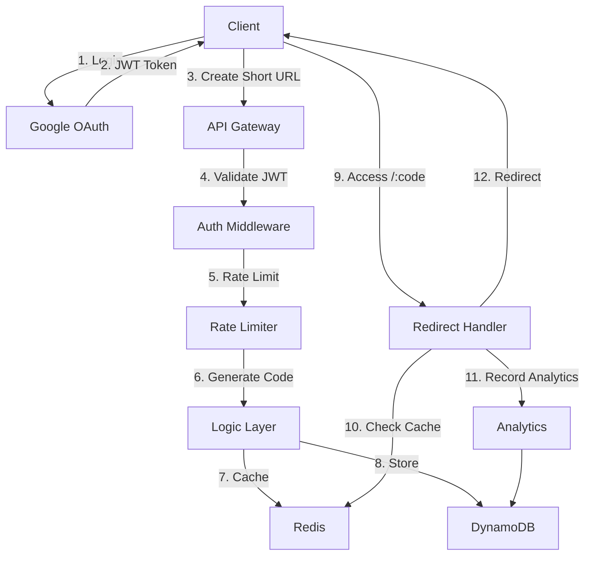

# 🔗 patrn.ink - Production-Ready URL Shortener

A feature-rich URL shortener built with Go, featuring Google OAuth 2.0, real-time analytics, QR code generation, and custom short links. Perfect for showcasing modern backend development skills.

## ✨ Features

- **🔐 Google OAuth 2.0** - Secure authentication with Google Sign-In
- **📊 Analytics Dashboard** - Track clicks, referrers, devices, and more
- **🎨 Custom Short Codes** - Create memorable branded links (e.g., `/resume`, `/portfolio`)
- **📱 QR Code Generation** - Dynamic QR codes for every short URL
- **⏰ Link Expiration** - Set TTL for temporary links
- **🚦 Rate Limiting** - Token bucket algorithm to prevent abuse
- **📈 Prometheus Metrics** - Production-ready monitoring
- **⚡ Redis Caching** - Ultra-fast redirects
- **🗄️ DynamoDB Storage** - Scalable NoSQL backend
- **🐳 Docker Support** - Complete containerization

## 🏗️ Architecture



## 🚀 Quick Start

### Prerequisites

- Go 1.22+
- Docker & Docker Compose
- Google Cloud Console account (for OAuth)

### 1. Google OAuth Setup

1. Go to [Google Cloud Console](https://console.cloud.google.com/)
2. Create a new project or select existing
3. Enable **Google+ API**
4. Create **OAuth 2.0 Client ID** (Web application)
5. Add authorized redirect URI: `http://localhost:8080/auth/google/callback`
6. Copy **Client ID** and **Client Secret**

### 2. Environment Configuration

```bash
cp .env.example .env
# Edit .env with your Google OAuth credentials
```

### 3. Run with Docker

```bash
# Start all services
docker-compose up --build
```

The application will be available at `http://localhost:8080`

## 📚 API Endpoints

### Authentication

| Method | Endpoint                | Description      |
| ------ | ----------------------- | ---------------- |
| GET    | `/auth/google/login`    | Start OAuth flow |
| GET    | `/auth/google/callback` | OAuth callback   |

### URL Management (Protected)

| Method | Endpoint               | Description      |
| ------ | ---------------------- | ---------------- |
| POST   | `/api/shorten`         | Create short URL |
| GET    | `/api/links`           | Get user's links |
| GET    | `/api/links/:code`     | Get link details |
| PUT    | `/api/links/:code`     | Update link      |
| DELETE | `/api/links/:code`     | Delete link      |
| GET    | `/api/analytics/:code` | Get analytics    |

### Public

| Method | Endpoint    | Description          |
| ------ | ----------- | -------------------- |
| GET    | `/:code`    | Redirect to long URL |
| GET    | `/:code/qr` | Get QR code image    |
| GET    | `/health`   | Health check         |
| GET    | `/metrics`  | Prometheus metrics   |

## 💡 Usage Examples

### Create Short URL

```bash
# Login and get JWT token first
curl -X POST http://localhost:8080/api/shorten \
  -H "Authorization: Bearer YOUR_JWT_TOKEN" \
  -H "Content-Type: application/json" \
  -d '{
    "long_url": "https://example.com/very/long/url",
    "custom_code": "my-link",
    "expires_in": 168
  }'
```

Response:

```json
{
	"short_url": "http://localhost:8080/my-link",
	"short_code": "my-link",
	"long_url": "https://example.com/very/long/url",
	"qr_code_url": "http://localhost:8080/my-link/qr",
	"expires_at": "2026-01-25T18:00:00Z"
}
```

### Access Short URL

```bash
curl -L http://localhost:8080/my-link
# Redirects to https://example.com/very/long/url
```

### Get QR Code

```bash
curl http://localhost:8080/my-link/qr -o qrcode.png
```

## 🧪 Testing

```bash
# Run tests
go test -race ./...

# Check coverage
go test -cover ./...
```

## 📊 Monitoring

### Health Check

```bash
curl http://localhost:8080/health
```

### Prometheus Metrics

```bash
curl http://localhost:8080/metrics
```

Available metrics:

- `http_requests_total` - Total HTTP requests by method, endpoint, status
- `http_request_duration_seconds` - Request latency histogram
- `redirects_total` - Total number of redirects

## 🔧 Configuration

All configuration via environment variables (see `.env.example`):

| Variable               | Description     | Default                |
| ---------------------- | --------------- | ---------------------- |
| `PORT`                 | Server port     | `8080`                 |
| `GOOGLE_CLIENT_ID`     | OAuth client ID | Required               |
| `GOOGLE_CLIENT_SECRET` | OAuth secret    | Required               |
| `JWT_SECRET`           | JWT signing key | `dev-secret-key`       |
| `DYNAMODB_ENDPOINT`    | Local endpoint  | `http://dynamodb:8000` |
| `REDIS_ADDR`           | Redis address   | `redis:6379`           |

## 🏭 Production Deployment

### AWS Setup

1. **DynamoDB**: Remove `DYNAMODB_ENDPOINT` to use production AWS DynamoDB
2. **Redis**: Use AWS ElastiCache or Redis Cloud
3. **Update OAuth**: Add production redirect URI to Google Console
4. **SSL**: Use HTTPS with valid certificate
5. **Environment**: Set `ENVIRONMENT=production`

### Build for Production

```bash
# Build Docker image
docker build -t patrnink-api:latest .
```

## 🛠️ Technology Stack

- **Language**: Go 1.22
- **Framework**: Gin
- **Authentication**: Google OAuth 2.0 + JWT
- **Database**: DynamoDB (NoSQL)
- **Cache**: Redis
- **Logging**: Zap (structured JSON)
- **Metrics**: Prometheus
- **Containerization**: Docker

## 📁 Project Structure

```
patrn.ink/
├── main.go              # Application entry point
├── config.go            # Configuration management
├── models.go            # Data models
├── storage.go           # DynamoDB & Redis layer
├── auth.go              # Google OAuth & JWT
├── logic.go             # Business logic & handlers
├── middleware.go        # Custom middleware
├── analytics.go         # Analytics collection
├── qrcode.go            # QR code generation
├── logger.go            # Structured logging
├── logic_test.go        # Unit tests
├── Dockerfile           # Container image
├── docker-compose.yml   # Local development
├── Makefile             # Development commands
└── .env.example         # Environment template
```

## 🤝 Contributing

This is a portfolio project, but suggestions are welcome!

## 📝 License

MIT License

## 🎯 Resume Highlights

**Why This Project Stands Out:**

✅ **Production-Ready**: Graceful shutdown, health checks, metrics  
✅ **Cloud-Native**: DynamoDB, Redis, containerized  
✅ **Secure**: OAuth 2.0, JWT, rate limiting  
✅ **Scalable**: Caching, async analytics, efficient storage  
✅ **Observable**: Structured logging, Prometheus metrics  
✅ **Well-Tested**: Unit tests, race detection  
✅ **Clean Code**: Modular architecture, separation of concerns

---

Built with ❤️ by [Your Name] | [GitHub](https://github.com/yourusername) | [LinkedIn](https://linkedin.com/in/yourprofile)
