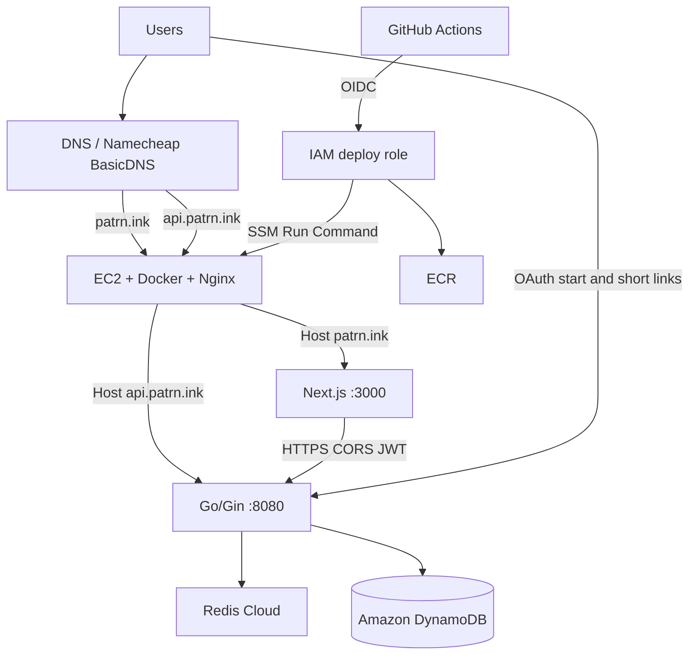

# patrn.ink production deployment

This directory is the production runbook and host layout. It does **not** replace local development.

- Local API still uses the repo-root `docker-compose.yml` (DynamoDB Local + Redis + published ports).
- Local UI still uses `npm run dev` and `.env.local` pointing at `http://localhost:8080`.
- Production uses this folder on the EC2 host at `/opt/patrn.ink`.

AWS accounts and TLS certificates are created in **your** AWS account. DNS for `patrn.ink` is managed at **Namecheap BasicDNS**. The files here are the configuration and IAM policy templates. They do not create those resources by themselves.

## Architecture

```text
                  DNS (Namecheap BasicDNS)
                            |
                       +----+----+
                       |         |
                 patrn.ink   api.patrn.ink
                       |         |
                       +--- EC2 -+
                           Nginx
                         /       \
                   UI :3000     API :8080
                     Next.js      Go/Gin
                                    |
                             +------+------+
                             |             |
                      Redis Cloud     Amazon DynamoDB
                       (redis.io)         (AWS)
```



Domain contract (do not change):

| Host | Target |
| --- | --- |
| `https://patrn.ink` | Next.js UI |
| `https://api.patrn.ink` | Go API, OAuth callbacks, `/{code}` redirects |
| `https://api.patrn.ink/{code}` | Public short links |

Short links are **never** routed through Next.js.

## Local development

From `patrn.ink-api`:

```bash
cp .env.example .env
# fill Google OAuth localhost callbacks
docker compose up --build
```

From `patrn.ink-ui`:

```bash
cp .env.example .env.local
npm install
npm run dev
```

Local defaults stay on localhost. Do not point `.env.local` at production unless you intend to talk to the live API.

## Production environment variables

On the EC2 host, copy `env.prod.example` to `/opt/patrn.ink/.env`.

Compose hard-wires the public contract:

- `ENVIRONMENT=production`
- `BASE_URL=https://api.patrn.ink`
- `FRONTEND_URL=https://patrn.ink`
- `ALLOWED_ORIGINS=https://patrn.ink`
- `GOOGLE_REDIRECT_URL=https://api.patrn.ink/auth/google/callback`
- `GITHUB_REDIRECT_URL=https://api.patrn.ink/auth/github/callback`

You supply secrets only: JWT, Redis Cloud password, OAuth client IDs/secrets, image tags, ECR registry.

- Do **not** set `DYNAMODB_ENDPOINT`. Production uses Amazon DynamoDB.
- Do **not** put AWS access keys on the instance. DynamoDB and ECR use the EC2 instance role.
- Redis Cloud password lives only in `/opt/patrn.ink/.env`. It is never committed.

UI production values are **build-args**, not runtime env:

```text
NEXT_PUBLIC_API_URL=https://api.patrn.ink
NEXT_PUBLIC_APP_URL=https://patrn.ink
```

The UI CD workflow passes those arguments. Local Dockerfile defaults remain localhost.

## Docker

`docker-compose.prod.yml` runs three services on EC2:

| Service | Image | Published ports |
| --- | --- | --- |
| `nginx` | `nginx:1.27-alpine` | 80, 443 |
| `api` | ECR `patrn-ink-api:<tag>` | none |
| `ui` | ECR `patrn-ink-ui:<tag>` | none |

Managed outside the box:

| Service | Where |
| --- | --- |
| Redis | Redis Cloud (`redis.io`) |
| DynamoDB | Amazon DynamoDB in `us-east-1` |

Logs rotate (`json-file`, 10m × 3 files). Production does **not** run Redis or DynamoDB Local on EC2.

API and UI images include Docker `HEALTHCHECK`s. API uses `GET /health` (200 healthy, 503 degraded).

## ECR

Create two repositories:

- `patrn-ink-api`
- `patrn-ink-ui`

Images are tagged with the 12-character git SHA and the git ref (`v0.1.0` or the branch name). Compose pins the SHA stored in `.env`.

## EC2

Practical size: `t3.small`, Ubuntu 24.04, public subnet, Elastic IP.

Install Docker Engine, the Compose plugin, the AWS CLI, `curl`, and confirm the SSM agent is running (`amazon-ssm-agent`).

Attach instance profile `patrn-ec2`. Increase the IMDS hop limit so containers can assume the instance role:

```bash
aws ec2 modify-instance-metadata-options \
  --instance-id i-xxxxxxxx \
  --http-tokens required \
  --http-put-response-hop-limit 2
```

One-time host layout:

```bash
sudo mkdir -p /opt/patrn.ink
sudo chown ubuntu:ubuntu /opt/patrn.ink
# copy the deploy/ directory from this repo
rsync -a deploy/ /opt/patrn.ink/
cp /opt/patrn.ink/env.prod.example /opt/patrn.ink/.env
chmod 600 /opt/patrn.ink/.env
# edit /opt/patrn.ink/.env
```

## IAM

Replace `AWS_REGION`, `AWS_ACCOUNT_ID`, and `EC2_INSTANCE_ID` in `iam/*.json`.

**EC2 instance role** (`patrn-ec2`):

- Managed policy `AmazonSSMManagedInstanceCore`
- Custom policy `iam/ec2-instance-role-policy.json` (DynamoDB tables `Users`, `Links`, `Analytics`, `APITokens` + ECR pull)

**GitHub OIDC role** (`patrn-github-deploy`):

1. Create the OIDC provider `token.actions.githubusercontent.com` if it does not exist.
2. Trust policy: `iam/github-oidc-trust-policy.json` (both `TukitoZenx/patrn.ink-api` and `TukitoZenx/patrn.ink-ui`).
3. Permissions: `iam/github-actions-role-policy.json` (ECR push + SSM SendCommand to this instance).

Do not attach `AdministratorAccess`. Do not put long-lived access keys in GitHub Secrets.

## Security group

| Port | Source | Why |
| --- | --- | --- |
| 22 | your admin IP only | Emergency SSH, never used by CI |
| 80 | `0.0.0.0/0` | ACME + HTTP→HTTPS |
| 443 | `0.0.0.0/0` | HTTPS |

Do not open 3000, 8080, 6379, or 8000.

## Nginx

- `patrn.ink` → `ui:3000`
- `api.patrn.ink` → `api:8080`
- Forwards `Host`, `X-Forwarded-Proto`, `X-Forwarded-Host`, `X-Forwarded-For`
- `GET /metrics` on the API host returns 404 at Nginx
- Unknown hostnames are dropped (`444`)

## HTTPS / Certbot

Certificates do not exist on a fresh box. Do not start from the HTTPS template.

1. Point the Namecheap BasicDNS A records for `patrn.ink`
   and `api.patrn.ink` at the Elastic IP.
2. Start the stack with the committed HTTP config (`scripts/deploy.sh` or `docker compose ... up -d`).
3. Run `scripts/bootstrap-certs.sh` (webroot challenge, both names, one certificate).
4. That script calls `scripts/enable-https.sh`, which installs the TLS server blocks and HTTP→HTTPS redirects, then reloads Nginx.

Renewal:

```bash
sudo crontab -e
# 0 3 * * * /opt/patrn.ink/scripts/renew-certs.sh
```

## DNS

DNS is managed through Namecheap BasicDNS.

| Name | Type | Value |
| --- | --- | --- |
| `patrn.ink` | A | `32.195.241.185` |
| `api.patrn.ink` | A | `32.195.241.185` |
| `www.patrn.ink` | CNAME | Existing Vercel record |

Managed in Namecheap → Domain List → `patrn.ink` → Advanced DNS. Nameservers stay on **Namecheap BasicDNS**. Route 53 is not used. `www` remains a Vercel CNAME and is not required for this stack.

OAuth consoles must allow:

- `https://api.patrn.ink/auth/google/callback`
- `https://api.patrn.ink/auth/github/callback`

## CI/CD

### Pull requests

- API: `go vet ./...` and `go test ./...`
- UI: `npm ci`, `npm run lint`, `npm run build` with localhost public URLs

### Release / manual dispatch

```text
git tag / workflow_dispatch
  → GitHub Actions
  → OIDC assume role
  → build and push ECR (SHA + ref tags)
  → SSM Run Command
  → /opt/patrn.ink/scripts/deploy.sh
  → docker compose pull && up -d
  → /health
```

Required GitHub configuration **in both repos**:

| Kind | Name | Purpose |
| --- | --- | --- |
| Secret | `AWS_ROLE_ARN` | OIDC role to assume |
| Variable | `AWS_REGION` | e.g. `us-east-1` |
| Variable | `EC2_INSTANCE_ID` | target instance |
| Variable | `ECR_API_REPOSITORY` | API repo only, e.g. `patrn-ink-api` |
| Variable | `ECR_UI_REPOSITORY` | UI repo only, e.g. `patrn-ink-ui` |

CI/CD does **not** use SSH and does **not** use `AWS_ACCESS_KEY_ID` / `AWS_SECRET_ACCESS_KEY`.

## Health checks

```bash
curl -sS https://api.patrn.ink/health
# 200 + "healthy" when Redis Cloud and DynamoDB respond
# 503 + "degraded" when a dependency is down
```

## Logging

- API: Zap JSON when `ENVIRONMENT=production`
- Prometheus metrics stay on the API container (`:8080/metrics`) and are not published by Nginx
- Docker JSON logs, rotated

CloudWatch Agent can be added later. It is not part of v1.

## Rollback

```bash
cd /opt/patrn.ink
./scripts/rollback.sh api <previous-sha-or-tag>
./scripts/rollback.sh ui  <previous-sha-or-tag>
```

That writes the tag into `.env`, pulls the older image, and runs the same health checks.

## First production bring-up

1. Create ECR repos, IAM roles, SG, EC2, Elastic IP, and Namecheap A records.
2. Copy `deploy/` to `/opt/patrn.ink` and fill secrets in `.env`. Leave image tags until step 4.
3. In each GitHub repo, run **Actions → CD → Run workflow** with **Deploy to EC2** unchecked so images are pushed without SSM.
4. Put those SHA tags into `/opt/patrn.ink/.env` as `API_IMAGE_TAG` and `UI_IMAGE_TAG`.
5. `cd /opt/patrn.ink && ./scripts/deploy.sh`
6. Confirm `http://api.patrn.ink/health` through the Elastic IP / DNS.
7. `./scripts/bootstrap-certs.sh`
8. Confirm `https://patrn.ink` and `https://api.patrn.ink/health`.
9. After that, leave **Deploy to EC2** checked (the default). Tags `v*` always deploy.

## Troubleshooting

| Symptom | Likely cause |
| --- | --- |
| API exits on boot, JWT error | `JWT_SECRET` still `dev-secret-key` or empty |
| API cannot reach DynamoDB from Docker | IMDS hop limit is 1; set it to 2. Or instance role missing table permissions |
| API `/health` shows redis false | Wrong `REDIS_ADDR` / username / Redis Cloud password in `/opt/patrn.ink/.env` |
| UI calls `localhost:8080` in production | UI image was built without production Docker build-args |
| OAuth works locally, fails in prod | Callback URLs not added in Google/GitHub consoles |
| Certbot fails | DNS not pointing at this EIP yet, or port 80 blocked |
| Nginx fails after `enable-https.sh` | Certificates missing; restore `nginx/conf.d/http.conf` from git and retry bootstrap |
| SSM deploy hangs / Unauthorized | Instance not registered with SSM, or GitHub role cannot `ssm:SendCommand` |
| CORS errors in the browser | `ALLOWED_ORIGINS` must be exactly `https://patrn.ink` |

## What this folder is not

It is not Terraform. It is not ECS/EKS. It is not the local Compose file. Production does not run Redis or DynamoDB Local on EC2.
